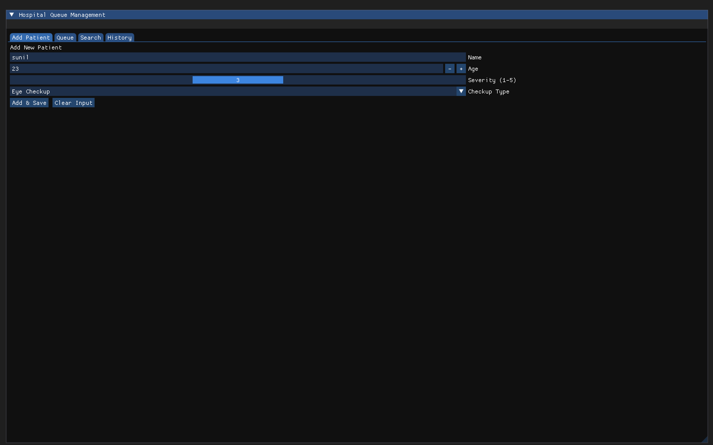
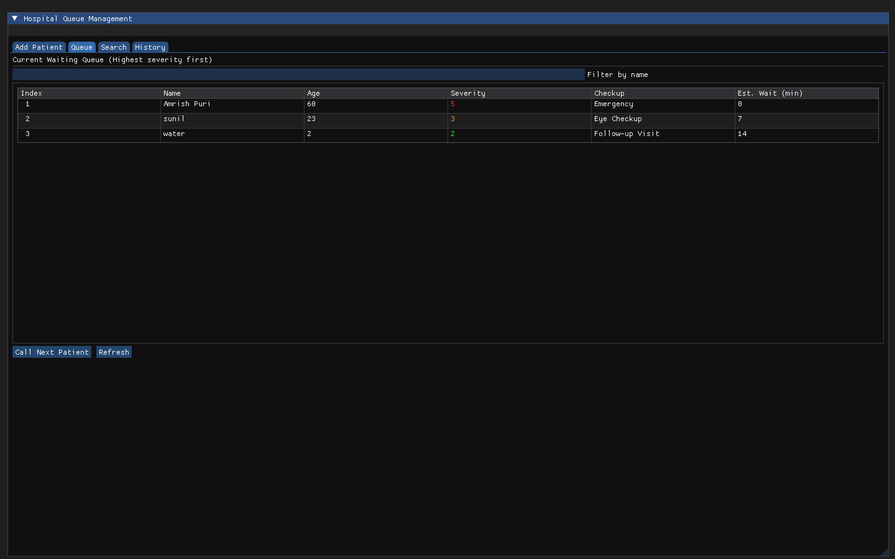
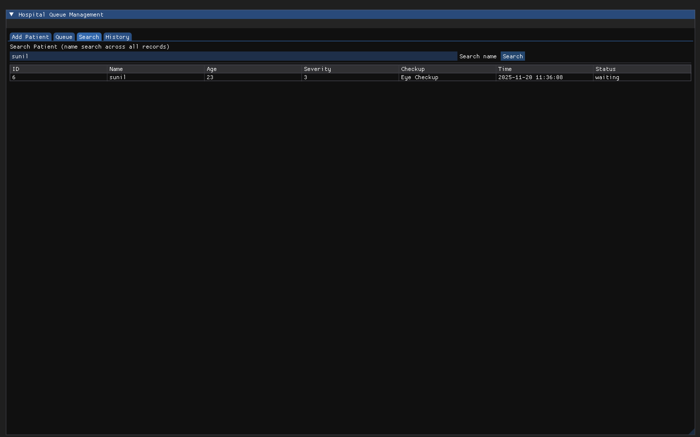
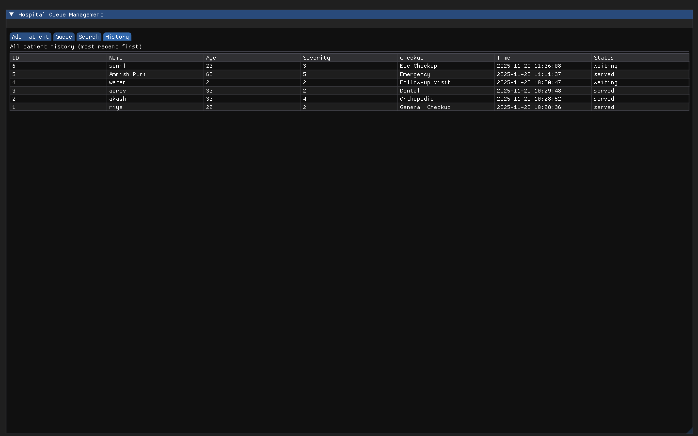

# Hospital Queue GUI with SQLite

A desktop application to manage patient queues in a hospital using a graphical user interface (GUI) built with ImGui and C++, with persistent storage using SQLite.

---

## Description

This project allows hospital staff to manage patient check-ins, queue ordering, and patient history. It also records the type of checkup each patient received. The application provides a simple and intuitive GUI for adding, serving, and tracking patients.

---

## Software Used

**Frontend:**  
- ImGui (Dear ImGui) – GUI  
- OpenGL – Rendering backend  
- GLFW – Window creation & input handling  

**Backend:**  
- SQLite – Database to store patient records permanently  
- C++ – Core logic for queue management, sorting, and database operations  

---

## Programming Languages

- C++  

---

## Application Area

This software is intended for hospital administration, particularly for outpatient departments to manage patient queues efficiently and maintain a record of past checkups.

---

## How SQLite Connection is Formed

A single connection to `patients.db` is established at startup and used to execute SQL queries for adding, updating, and retrieving patient records.

---

## Results / Input-Output Screenshots

**Add Patient Info:**  
  

**Queue View:**  

**Search Patient:**  
  

**Patient History:**  
  

---

## Project Features

- Add new patients with name, age, gender, and checkup type  
- Serve patients in order  
- Track patient history  
- Persistent storage using SQLite  

---

## How to Run Project

- Open terminal in the project folder  
- Compile using g++  
- Run the executable  
- Use GUI to manage patients  

---

## Folder Structure

- `imgui/` – ImGui library files  
- `images/` – Screenshots for README  
- `main.cpp` – Main program  
- `Database.cpp` / `Database.hpp` – SQLite handling  
- `patients.db` – Database file
